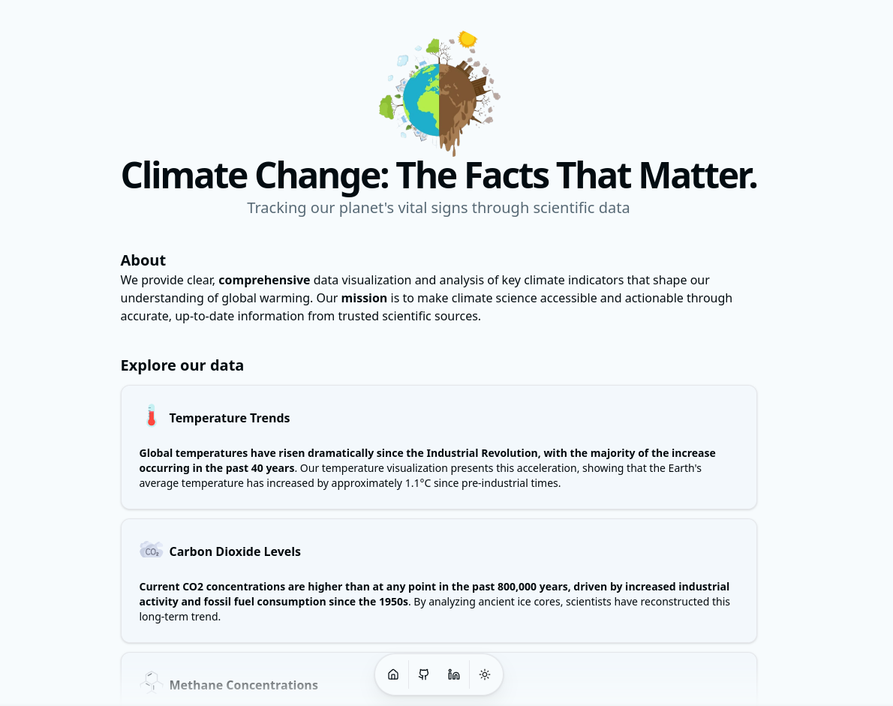
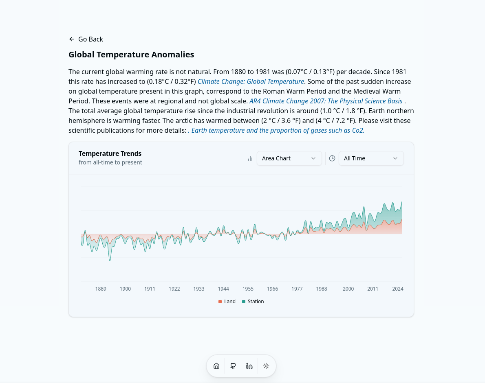

# Global Warming

- A website that provide clear, comprehensive data visualization and analysis of key climate indicators that shape our understanding of global warming.
- Demo: https://demo6.isaccobertoli.com/


## Tech Stack Client

- React
- Tailwind
- Typescript
- Shadcn UI
- Magic UI


## Images

<div>
    
    
</div>


## Getting Up and Running Locally

- Clone this repository to your local machine:

```bash
git clone https://github.com/Isacco-B/global-warming
```

- Move to the cloned directory

```bash
cd global-warming
```

- Install dependencies

```bash
npm install
```

- Start server

```bash
npm run dev
```

## 🔗 Links

[](https://www.linkedin.com/in/isacco-bertoli-10aa16252/)
